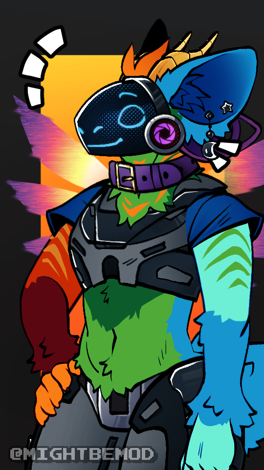

The above is my fursona called Apollo. I made this with [MOD's](https://www.reddit.com/user/ViktorPrevails/) [Protogen Creator REVAMPED](https://picrew.me/en/image_maker/2377345).

# Story
The Astrals are an advanced society of protogens, which live on Kepler 22-B. However unlike the [typical](https://www.reddit.com/r/protogen/comments/eologu/comment/ft2in0u/?utm_source=share&utm_medium=web3x&utm_name=web3xcss&utm_term=1&utm_content=share_button) lore of protogens, they are instead their own self-sustained species, which added these prosthetics for their own development. As this is my first literary work and my first conlang this will probably have alot of errors and holes in the language and in the story. If you want to leave _constructive_ critisism, then comment under [this](https://www.tumblr.com/byer20/753436882597298176/i-recently-made-a-fursona-with-mightbemods?source=share) Tumblr post!